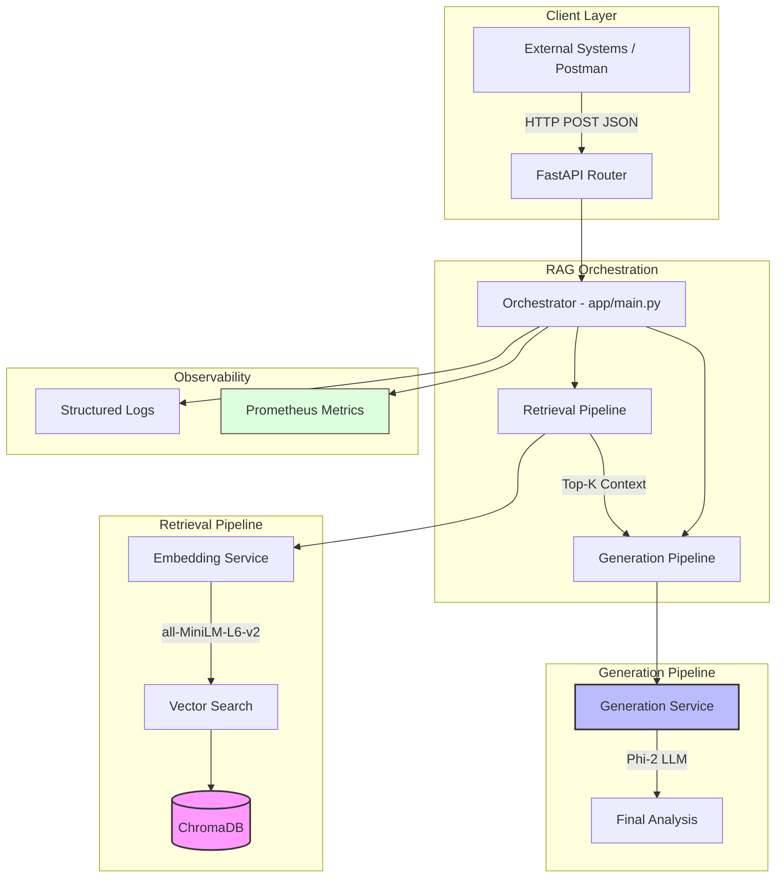
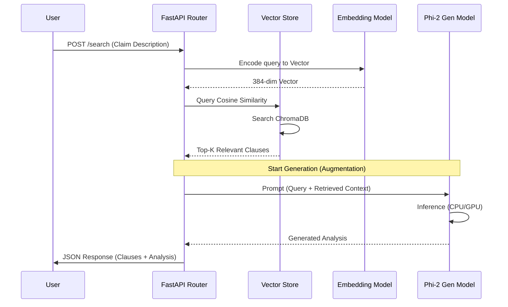

# Policy Intelligence API - System Design

This document details the architecture and technical design of the RAG-powered Policy Intelligence system.

## 1. High-Level Architecture

The system follows a modular architecture separating concern between data retrieval and AI generation.

## 2. Sequence Diagram (Request Flow)

The following diagram illustrates the lifecycle of a single policy search and analysis request.

## 3. Component Breakdown

### 3.1 Retrieval Strategy
- **Embedding Model**: `sentence-transformers/all-MiniLM-L6-v2`. Chosen for its balance between inference speed and semantic accuracy.
- **Distance Metric**: **Cosine Similarity**. Used to ensure similarity scores are normalized between 0 and 1, providing better filtering logic for the `min_score` parameter.

### 3.2 Generation Strategy
- **LLM**: `microsoft/phi-2`. A 2.7 billion parameter model that performs exceptionally well on reasoning tasks while remaining small enough for local deployment.
- **Prompt Engineering**: Uses an "Instruct" format to ground the model in the retrieved context, reducing hallucinations by forcing it to cite specific `clause_id`s found in the retrieval step.

### 3.3 Scalability & Performance
- **Async Execution**: The API uses a non-blocking architecture. Since Model Inference (both embedding and generation) is CPU/GPU intensive, these tasks are offloaded to an `asyncio` thread pool executor to keep the event loop responsive for other requests.
- **Local Persistence**: ChromaDB is configured with a persistent path (`./.chromadb`), ensuring data survives application restarts.
